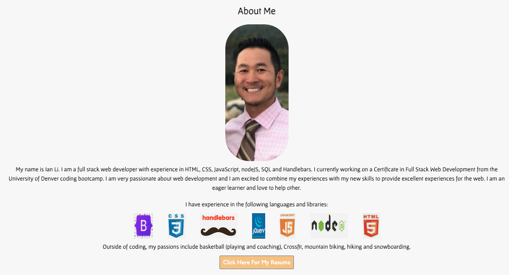
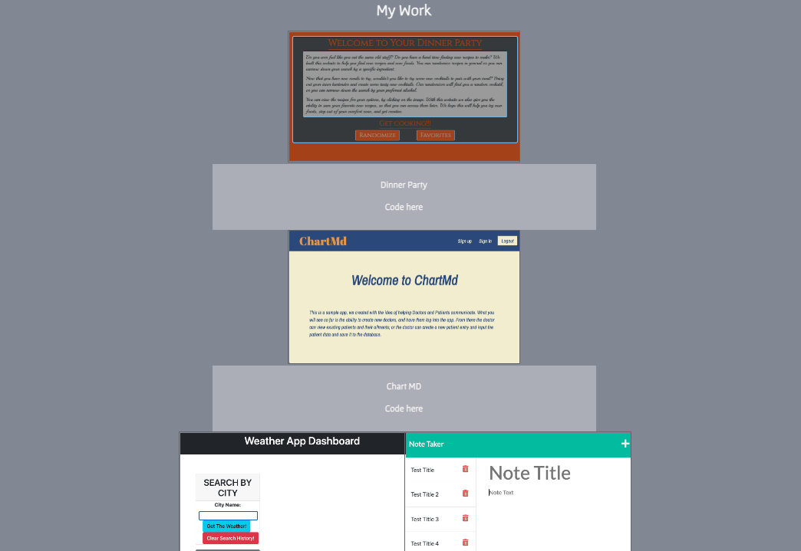
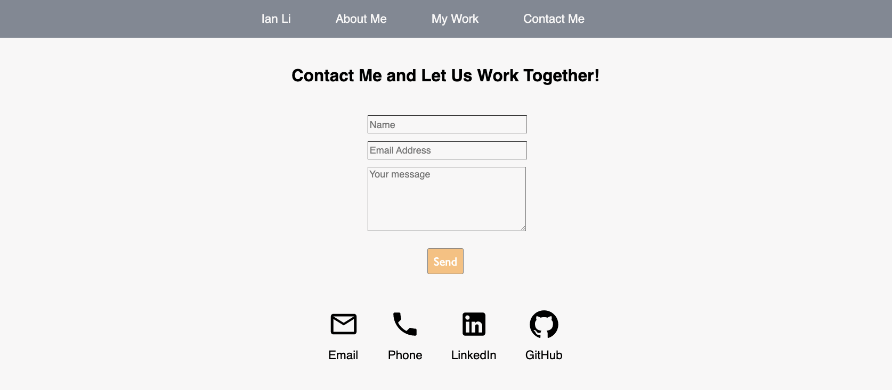

# Ian Li's Professional Portfolio
# Description
This is my professional portfolio for the University of Denver bootcamp. I created the project using React.  This portfolio showcases homeworks and projects that utilitizes a variety of different coding tools in the last 8 months.

## Questions

If you have any questions about the application, please contact me directly @ Ian.Li1023@gmail.com.

** Deployed Link: https://secret-plateau-76469.herokuapp.com/#IanLi

You can also visit my pages below!!

** Github Username: IanLi1023

** Github Profile: www.github.com/IanLi1023
